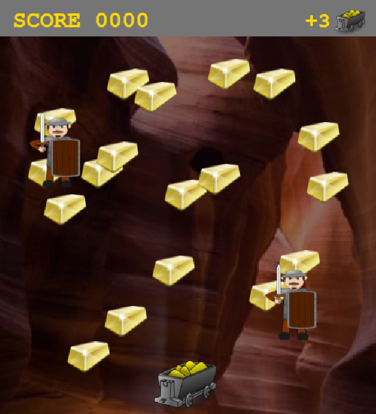

## Final Project - Gold Mine

Final project that our group completed for the web development class.   

## The Team:
Benjamin Gomori 
Benjamin Seamon 

## The Game:
The user needs to collect treasures and avoid colliding with the guards that  are moving across the screen. There are three levels in the game.  

## Technologies:
Phaser 3 
JavaScript 
HTML 
The Open Weather Map API 
 
## Screenshot

